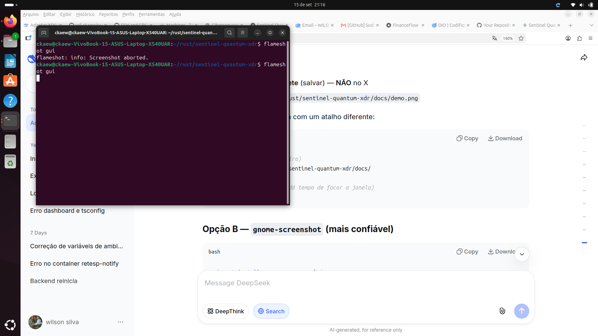
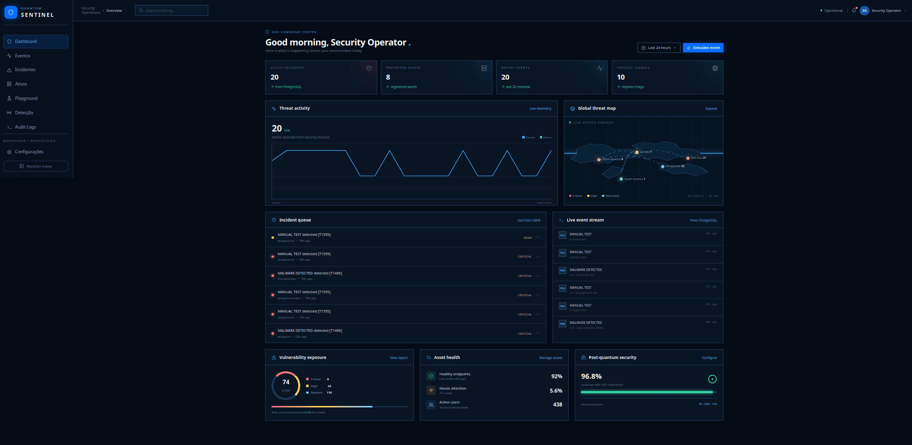
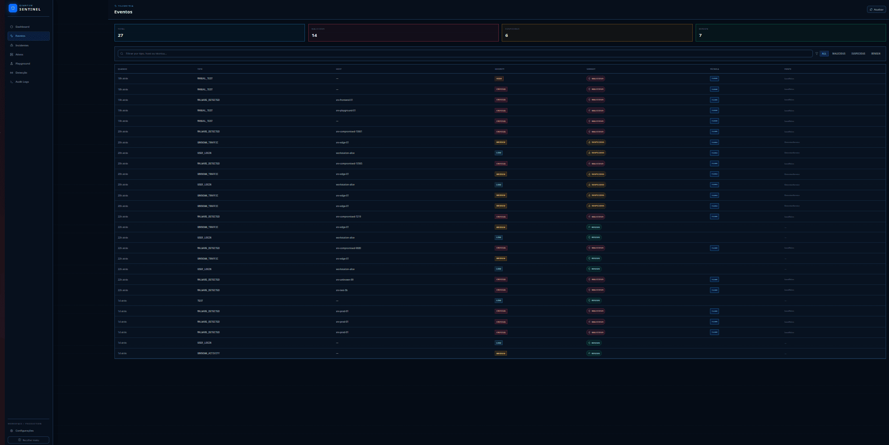
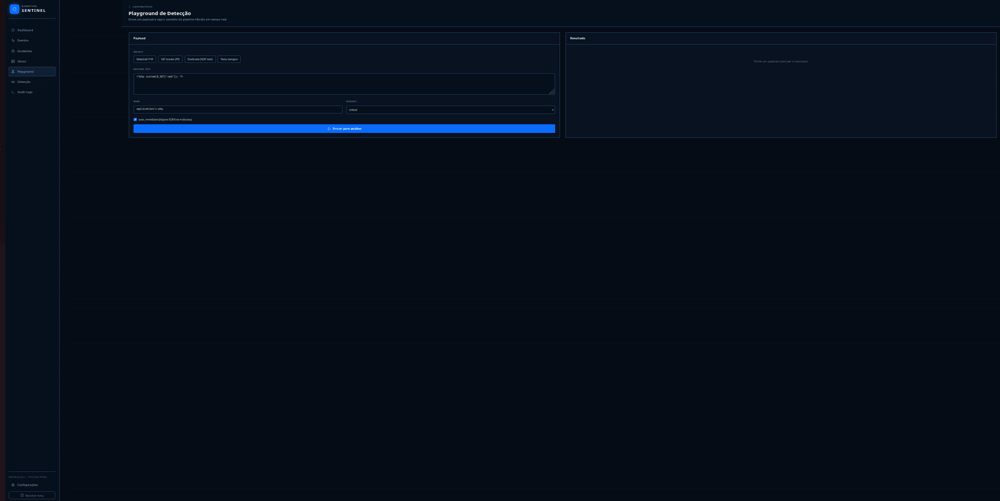

# Sentinel Quantum XDR


Plataforma XDR (Extended Detection and Response) com **detecção híbrida** — regras determinísticas MITRE ATT&CK + inferência ML via ONNX — e resposta automatizada via SOAR.



---

## Índice

- [Arquitetura](#arquitetura)
- [Componentes](#componentes)
- [Como rodar](#como-rodar)
- [Endpoints](#endpoints)
- [Detecção híbrida](#detecção-híbrida)
- [Modelo ML](#modelo-ml)
- [SOAR](#soar)
- [Observabilidade](#observabilidade)
- [Frontend](#frontend)
- [Testes](#testes)
- [Decisões de design](#decisões-de-design)
- [Estrutura do projeto](#estrutura-do-projeto)
- [Roadmap](#roadmap)

---


## Screenshots

### Dashboard

*Threat map global, estatísticas em tempo real, eventos recentes.*

### Events

*Tabela de eventos com verdict colorido, técnica MITRE e fonte de detecção.*

### Incident Detail

*Timeline visual: evento → detecção → MITRE → incidente → SOAR.*

### Playground

*Envie payload arbitrário e veja o veredito do pipeline híbrido em tempo real.*

### Detection Pipeline

*Status dos 3 componentes (gateway, detection-service, ml-inference) + modelo ONNX.*

### Mobile (Expo)

App mobile com Dashboard, Eventos, Incidentes e Ativos. Mesmo backend do web. Acesse em `http://localhost:8081`.


---

## Arquitetura

┌────────────────────────────────────────────────────────────────────┐
│ CLIENTES │
│ Endpoints (agente) · Rede (sensor) · Cloud (webhook) │
└───────────────────────────┬────────────────────────────────────────┘
│ POST /api/events
▼
┌────────────────────────────────────────────────────────────────────┐
│ GATEWAY (Rust / Axum) │
│ │
│ ┌──────────────────┐ ┌──────────────────┐ │
│ │ events::handler │───▶│ detection:: │ │
│ │ │ │ classify_hybrid │ │
│ └────────┬─────────┘ └────────┬─────────┘ │
│ │ │ │
│ │ ┌────────┴──────────┐ │
│ │ │ │ │
│ │ local_rules DetectionClient │
│ │ (microsseg) (retry + breaker) │
│ │ │ │ │
│ │ └────────┬──────────┘ │
│ │ │ │
│ │ ▼ │
│ │ ┌────────────────────┐ │
│ │ │ detection-service │ │
│ │ │ (Rust) │ │
│ │ │ • regras YARA-like│ │
│ │ │ • cliente ML │ │
│ │ └─────────┬──────────┘ │
│ │ │ │
│ │ ▼ │
│ │ ┌────────────────────┐ │
│ │ │ ml-inference │ │
│ │ │ (Python/FastAPI) │ │
│ │ │ • ONNX runtime │ │
│ │ │ • heurística │ │
│ │ └────────────────────┘ │
│ │ │
│ ▼ │
│ ┌──────────────────────┐ │
│ │ events::collector │ │
│ │ • INSERT event │ │
│ │ • threat intel │ │
│ │ • correlação 10min │ │
│ │ • incidente │ │
│ │ • SOAR │ │
│ └──────────┬───────────┘ │
│ │ │
│ ├──▶ Postgres (eventos, incidentes, assets, audit) │
│ │ │
│ └──▶ RabbitMQ (3 exchanges) │
│ │
│ ┌──────────────────────┐ │
│ │ services::metrics │───▶ Prometheus │
│ └──────────────────────┘ │
└────────────────────────────────────────────────────────────────────┘
│
▼
┌────────────────────────────────────────────────────────────────────┐
│ FRONTEND (Next.js 15) │
│ Dashboard · Events · Incidents · Detail · Assets · Audit · │
│ Detection · Playground │
└────────────────────────────────────────────────────────────────────┘
text


---

## Componentes

| Serviço | Linguagem | Porta | Função |
|---|---|---|---|
| `gateway` | Rust 1.89 | 8080 | API REST, orquestração, detecção local + fallback, SOAR |
| `detection-service` | Rust 1.89 | 8090 | Regras + cliente ML, engine de veredito |
| `ml-inference` | Python 3.12 | 5000 | Inferência ONNX (fallback heurístico) |
| `postgres` | PostgreSQL 16 | 5432 | Persistência (eventos, incidentes, assets, audit) |
| `redis` | Redis 7 | 6379 | Cache |
| `rabbitmq` | RabbitMQ 3 | 5672 / 15672 | Mensageria (3 exchanges) |
| `prometheus` | Prometheus | 9090 | Observabilidade |
| `frontend` | Next.js 15 | 3000 | Dashboard XDR |

---

## Como rodar

### Pré-requisitos

- Docker 24+ com Compose v2
- 4GB RAM livres
- Portas livres: 3000, 5000, 5432, 5672, 6379, 8080, 8090, 9090, 15672

### Setup

```bash
git clone git@github.com:wil-ckaew/sentinel-quantum-xdr.git
cd sentinel-quantum-xdr

# .env
cat <<'ENV' > .env
POSTGRES_USER=sentinel
POSTGRES_PASSWORD=sentinel_dev_password
POSTGRES_DB=sentinel_db
POSTGRES_PORT=5432

REDIS_PORT=6379
RABBITMQ_USER=sentinel
RABBITMQ_PASSWORD=sentinel
RABBITMQ_PORT=5672
RABBITMQ_MANAGEMENT_PORT=15672

JWT_SECRET=change_me_to_a_long_random_string_at_least_32_chars
TENANT_ID=

GATEWAY_PORT=8080
FRONTEND_PORT=3000
PROMETHEUS_PORT=9090
ENV

# Sobe a stack
docker compose up -d --build

# Aguarda healthchecks (~40s)
sleep 40

# Verifica
curl -fsS http://localhost:8080/health/detailed | jq .

Demo automática
bash

./demo.sh

O script:

    Sobe a stack

    Aguarda healthchecks

    Envia 3 eventos (benigno, suspeito, malicioso)

    Mostra incidentes, assets isolados, audit logs, métricas

Testar detecção
bash

# Webshell PHP → deve dar Malicious + T1486
curl -fsS -X POST http://localhost:8080/api/events \
  -H 'Content-Type: application/json' \
  -d '{
    "source":"endpoint","severity":"critical","event_type":"MALWARE_DETECTED",
    "category":"endpoint","is_attack":true,"auto_remediate":true,
    "hostname":"srv-test-01",
    "payload_text":"<?php system($_GET[\"cmd\"]); ?>",
    "mime":"application/x-php","payload":{}
  }' | jq .

Endpoints
Gateway
Método	Path	Descrição
GET	/health	Liveness
GET	/health/detailed	Readiness (Postgres, Redis, Rabbit, detection-service)
GET	/metrics	Prometheus
POST	/api/events	Ingestão + detecção + resposta
GET	/api/events	Lista eventos (enriquecido com verdict + MITRE)
POST	/api/agents/events	Alias para /api/events
GET	/api/assets	Lista assets
POST	/api/assets	Cadastra asset
GET	/api/assets/{id}	Detalhe do asset
DELETE	/api/assets/{id}	Remove asset
PATCH	/api/assets/{id}/status	Atualiza status (active, isolated, quarantined)
GET	/api/incidents	Lista incidentes
POST	/api/incidents	Cria incidente
GET	/api/incidents/{id}	Detalhe do incidente
GET	/api/incidents/{id}/detail	Incidente + eventos + audit logs
PUT	/api/incidents/{id}	Atualiza incidente
GET	/api/audit	Audit logs (filtros: action, resource, limit)
GET	/api/detection/status	Status do pipeline (3 componentes + modelo)
POST	/api/soar/action	Dispara playbook manualmente
POST	/api/threat-intel	Cria indicador IOC
GET	/api/threat-intel	Lista indicadores
detection-service
Método	Path	Descrição
GET	/health	Health check
POST	/analyze	Regras + ML sobre um payload
ml-inference
Método	Path	Descrição
GET	/health	Health check
GET	/model	Info do modelo carregado
POST	/analyze	Inferência sobre payload
Detecção híbrida

O pipeline tem duas camadas com curto-circuito por confiança:
text

POST /api/events
  │
  ▼
[1] EVENTS_TOTAL++
  │
  ▼
[2] classify_hybrid()
  │
  ├─ regras locais (microssegundos)
  │     │
  │     └── se confidence >= 80 → LocalRules (fim, ML não é chamado)
  │
  └─ se inconclusivo → DetectionClient
        │
        ├─ retry 3x (backoff 100ms → 400ms)
        │
        ├─ circuit breaker (abre após 5 falhas em 30s)
        │
        └─ detection-service
              ├─ regras Rust (markers de webshell, shell execution, persistência)
              └─ se inconclusivo → ml-inference (ONNX)
  │
  ▼
[3] DETECTIONS_{MALICIOUS,SUSPICIOUS,BENIGN}++
  │
  ▼
[4] collector::collect()
      ├─ INSERT security_events
      ├─ threat intel lookup
      ├─ correlação 10min
      └─ se attack || threat || >=2 correlacionados:
            ├─ INSERT incidents
            ├─ INSERT incident_events
            ├─ UPDATE processed = TRUE
            └─ se auto_remediate:
                  ├─ ISOLATE_HOST → UPDATE assets
                  └─ INSERT audit_logs
  │
  ▼
[5] RabbitMQ publish
      ├─ security.events   (legado)
      ├─ detection.result  (veredito completo)
      └─ detection.alert   (só se malicious)

Regras locais (gateway)

Mapeamento MITRE ATT&CK determinístico, sem I/O:
Padrão	Tática	Técnica	Ação SOAR
PHISH	Initial Access	T1566	DISABLE_ACCOUNT
BRUTE / PASSWORD	Credential Access	T1110	DISABLE_ACCOUNT
LATERAL / REMOTE	Lateral Movement	T1021	ISOLATE_HOST
EXFIL / DATA_LOSS	Exfiltration	T1041	ISOLATE_HOST
MALWARE / RANSOM	Impact	T1486	ISOLATE_HOST
IDENTITY / TOKEN / OAUTH	Credential Access	T1078	DISABLE_ACCOUNT
CLOUD / IAM	Persistence	T1098	DISABLE_ACCOUNT
(fallback)	Unknown	T1595	CREATE_CASE
Regras do detection-service

    Webshell markers: eval(base64_decode, system($_, shell_exec(, passthru(, preg_replace('/.*/e, runtime.exec(, processbuilder(

    Shell execution: /bin/sh, /bin/bash, cmd.exe, powershell -enc, curl | sh, wget | sh, nc -e

    Persistência: currentversion\run, /etc/cron.d/, /etc/rc.local, systemd/system/, launchagents, launchdaemons

    MIME executável: x-dosexec, x-elf, executable

Modelo ML

Modelo de classificação binária (benign vs malicious) treinado com PyTorch e exportado para ONNX.
Arquitetura
text

Input (256 dims — byte histogram normalizado)
  │
  ▼
Linear(256, 128) → ReLU → Dropout(0.2)
  │
  ▼
Linear(128, 64) → ReLU → Dropout(0.2)
  │
  ▼
Linear(64, 2) → Softmax

Métricas
Métrica	Valor
Accuracy (test)	0.9407
Precision	0.9458
Recall	0.9372
F1	0.9415
Amostras	10.000 (5k/classe, sintéticas)
Épocas	60
Tamanho do modelo	162 KB
Retreinar
bash

cd ml-inference

# 1. Treina (PyTorch CPU)
make train

# 2. Verifica ONNX exportado
make verify

# 3. Rebuild + redeploy do container
make deploy

Targets disponíveis:

    make train — 5000 amostras/classe, 60 épocas

    make train-large — 20000 amostras/classe, 80 épocas

    make verify — valida separação benigno/malicioso

    make deploy — rebuild + redeploy do container

Fallback heurístico

Se model.onnx não existe, o ml-inference usa heurística baseada em entropia de histograma de bytes — o serviço sobe mesmo sem modelo treinado.
SOAR

Resposta automatizada disparada quando attack=true e confidence >= 75:
Playbook	Ação
ISOLATE_HOST	UPDATE assets SET status='isolated' (auto-registra se não existir)
DISABLE_ACCOUNT	(registra intenção no audit_log)
CREATE_CASE	(registra intenção no audit_log)
Override manual

O operador pode reativar hosts isolados via UI (/assets → botão "Reativar") ou API:
bash

curl -X PATCH http://localhost:8080/api/assets/{id}/status \
  -H 'Content-Type: application/json' \
  -d '{"status":"active"}'

Audit trail

Toda ação do SOAR é registrada em audit_logs com metadata completa:

    event_id, incident_id

    playbook executado

    detection_source (LocalRules / DetectionService)

    automatic: true

Observabilidade
Métricas Prometheus

Expuestas em GET /metrics:
text

sentinel_events_total                              counter
sentinel_detections_total                          counter
sentinel_detections_by_verdict{verdict}            counter (malicious/suspicious/benign)
sentinel_detection_fallbacks_total                 counter

Health checks

Gateway:
bash

curl -fsS http://localhost:8080/health/detailed | jq .

Retorna:
json

{
  "status": "ok",
  "service": "sentinel-gateway",
  "version": "0.1.0",
  "checks": {
    "postgres": true,
    "redis": true,
    "rabbitmq": true,
    "detection_service": true
  }
}

Pipeline completo:
bash

curl -fsS http://localhost:8080/api/detection/status | jq .

Retorna status dos 3 componentes + info do modelo ONNX.
Frontend

Next.js 15 com App Router, Tailwind CSS, TypeScript. 8 telas funcionais.
Rota	Função
/	Dashboard com threat map e stats em tempo real
/events	Tabela de eventos com verdict + MITRE + filtros
/incidents	Lista de incidentes com severidade e expansão
/incidents/[id]	Detalhe com timeline visual + audit trail
/assets	Inventário com isolar/reativar
/playground	Testar payload e ver veredito ao vivo
/audit	Audit logs do SOAR com metadata
/detection	Status dos 3 componentes + modelo ONNX
Build local
bash

cd frontend
npm install
npm run dev      # dev com hot reload
npm run build    # build de produção

Testes
bash

# Gateway
cd backend/gateway
cargo test

# Detection-service
cd backend/detection-service
cargo test

# ml-inference
cd ml-inference
make verify

Estado atual:

    Gateway: 10 testes (6 detection + 4 circuit breaker)

    Detection-service: 3 testes de regras

    CI: GitHub Actions (.github/workflows/ci.yml)

Decisões de design
Decisão	Motivo
Regras locais primeiro, ML depois	Latência: regra local é microssegundos; ML é rede + CPU
Curto-circuito por confidence >= 80	Evita chamada de rede quando desnecessário
detection-service stateless	Escala horizontal trivial; sem estado a sincronizar
ml-inference separado do detection-service	ML evolui em Python; regras em Rust
PyTorch → ONNX (não skl2onnx)	skl2onnx tem bugs recorrentes com RF; PyTorch + ONNX é a rota padrão
Retry + circuit breaker	Sem eles, uma instabilidade do detection-service derruba o gateway
incident.metadata guarda MITRE	Sem migration para colunas derivadas
Auto-registro de asset no SOAR	Fecha o ciclo para hosts desconhecidos
Publisher confirms no RabbitMQ	Garante entrega; sem perda silenciosa
payload opcional no request	Campo #[serde(default)] evita 422 em clientes que só enviam payload_text
Estrutura do projeto
text

sentinel-quantum-xdr/
├── backend/
│   ├── Cargo.toml                    # workspace
│   ├── gateway/                      # API principal
│   │   ├── src/
│   │   │   ├── main.rs               # bootstrap
│   │   │   ├── state.rs              # AppState
│   │   │   ├── detection.rs          # classify + classify_hybrid
│   │   │   ├── detection_client.rs   # cliente HTTP (retry + breaker)
│   │   │   ├── events/               # handlers, collector, producer
│   │   │   ├── assets/               # handler, service, repository
│   │   │   ├── incidents/            # handler, detail, service, repository
│   │   │   ├── audit/                # handler
│   │   │   ├── detection_status/     # handler (agrega status)
│   │   │   ├── routes/               # axum routers
│   │   │   ├── services/             # metrics
│   │   │   └── models/               # tipos compartilhados
│   │   └── Dockerfile
│   ├── detection-service/            # regras + cliente ML
│   ├── common/                       # tipos compartilhados
│   ├── auth-service/                 # autenticação JWT
│   ├── asset-service/                # inventário
│   ├── incident-service/             # gestão de incidentes
│   ├── quantum-service/              # PQC (post-quantum crypto)
│   ├── soar-engine/                  # playbooks
│   └── threat-intel/                 # feeds de IOC
├── ml-inference/                     # ONNX runtime + heurística
│   ├── app.py
│   ├── train.py                      # PyTorch MLP
│   ├── verify.py                     # valida ONNX
│   ├── Dockerfile
│   ├── Dockerfile.train              # imagem isolada de treino
│   ├── Makefile
│   └── models/
│       ├── model.onnx
│       └── metrics.json
├── frontend/                         # Next.js 15
│   ├── src/
│   │   ├── app/                      # App Router (8 rotas)
│   │   ├── components/               # VerdictBadge, SeverityBadge, etc.
│   │   └── lib/api.ts                # cliente HTTP tipado
│   └── Dockerfile
├── mobile/                           # Expo app
├── database/                         # migrations SQL
├── infrastructure/                   # nginx, docker
├── docs/                             # ARCHITECTURE.md, DEMO.md, screenshots
├── .github/workflows/ci.yml          # CI
├── docker-compose.yml
├── demo.sh                           # demo end-to-end
└── README.md

Roadmap
✅ Concluído

    ☑

    Pipeline híbrido (regras + ML) end-to-end
    ☑

    Modelo ONNX real (94% accuracy)
    ☑

    SOAR automático com override manual
    ☑

    Audit trail completo
    ☑

    Retry + circuit breaker
    ☑

    RabbitMQ (3 exchanges)
    ☑

    Prometheus (métricas)
    ☑

    Frontend (8 telas)
    ☑

    CI (GitHub Actions)
    ☑

    Docs + demo.sh

🚧 Próximas fases

    □

    mTLS entre gateway ↔ detection-service ↔ ml-inference
    □

    Retreino automático do modelo (tabela detection_events)
    □

    WebSocket para dashboard em tempo real (substituir polling)
    □

    Notificações Slack/Teams em incidentes critical
    □

    Suporte a mais formatos de payload (PE, ELF nativo)
    □

    Multi-tenancy real com isolamento por UI
    □

    Integração com feeds externos (VirusTotal, AbuseIPDB)

Licença

MIT — veja LICENSE.
Autor

wil-ckaew — github.com/wil-ckaew

Construído como projeto de portfólio demonstrando:

    Sistemas distribuídos em Rust

    ML em produção (PyTorch → ONNX)

    XDR / SOAR / detecção de ameaças

    Full-stack (backend + frontend + infra)
    EOF
echo "✔ README.md atualizado: $(wc -l < ~/rust/sentinel-quantum-xdr/README.md) linhas"
text


---

## Verifica antes de commitar

```bash
cd ~/rust/sentinel-quantum-xdr

# Confirma tamanho
wc -l README.md

# Mostra as primeiras 30 linhas
head -30 README.md

# Mostra as últimas 10
tail -10 README.md

Esperado:

    ~500 linhas

    Badges no topo

    Screenshot docs/demo.png

    Índice com 12 seções

    Tabelas de endpoints, MITRE, métricas

    Diagrama ASCII da arquitetura

    Roadmap

Commit
bash

cd ~/rust/sentinel-quantum-xdr

git add README.md
git status --short

git commit -m "docs: complete README with architecture, endpoints, ML, roadmap

- Full architecture diagram (gateway → detection-service → ml-inference)
- Component table with ports and stacks
- Setup + demo instructions
- Complete endpoint reference (24 endpoints)
- Hybrid detection pipeline explanation
- MITRE technique mapping table
- ML model card (PyTorch MLP, 94% accuracy, ONNX 162KB)
- SOAR playbooks + audit trail
- Prometheus metrics reference
- Frontend route table (8 screens)
- Test instructions
- Design decisions table
- Project structure
- Roadmap with completed and future phases"

git push

O que esperar

Depois do push, abre no navegador:

https://github.com/wil-ckaew/sentinel-quantum-xdr

Vai mostrar:

    ✅ Badges coloridos no topo

    ✅ Screenshot da demo

    ✅ Índice navegável com 12 seções

    ✅ Diagrama ASCII da arquitetura

    ✅ Tabela de 24 endpoints

    ✅ Tabela MITRE ATT&CK

    ✅ Model card do ML

    ✅ Roadmap com ✅ e 🚧

    ✅ Estrutura do projeto

É um README profissional — o tipo que faz recrutador parar e ler.
Depois do commit

Roda esse checklist final:
bash

cd ~/rust/sentinel-quantum-xdr

# 1. Confirma que as 8 rotas respondem
for r in "" "events" "incidents" "assets" "playground" "audit" "detection"; do
  code=$(curl -fsS "http://localhost:3000/$r" -o /dev/null -w "%{http_code}" 2>/dev/null || echo "ERR")
  echo "  /$r → $code"
done

# 2. Confirma endpoint detail
INCIDENT_ID=$(curl -fsS 'http://localhost:8080/api/incidents?limit=1' | jq -r '.[0].id')
curl -fsS "http://localhost:8080/api/incidents/$INCIDENT_ID/detail" | jq '{events: (.events|length), audit: (.audit_logs|length)}'

# 3. Confirma detection status
curl -fsS http://localhost:8080/api/detection/status | jq '{gateway: .gateway.healthy, ml: .ml_inference.healthy, model_loaded: .model.loaded}'

# 4. Confirma que o README está no GitHub
git log --oneline -5

Cola a saída.

Depois disso:

    Tira 4-5 screenshots das telas principais (/detection, /incidents/[id], /playground, /assets, /audit)

    Salva em docs/screenshots/

    Adiciona ao README (bloco novo, seção "Screenshots")

    Escreve o post no LinkedIn (30 min)

    Atualiza o CV

Mas o README está completo. Pode commitar e seguir.

Parabéns — o projeto está fechado. 🚀
